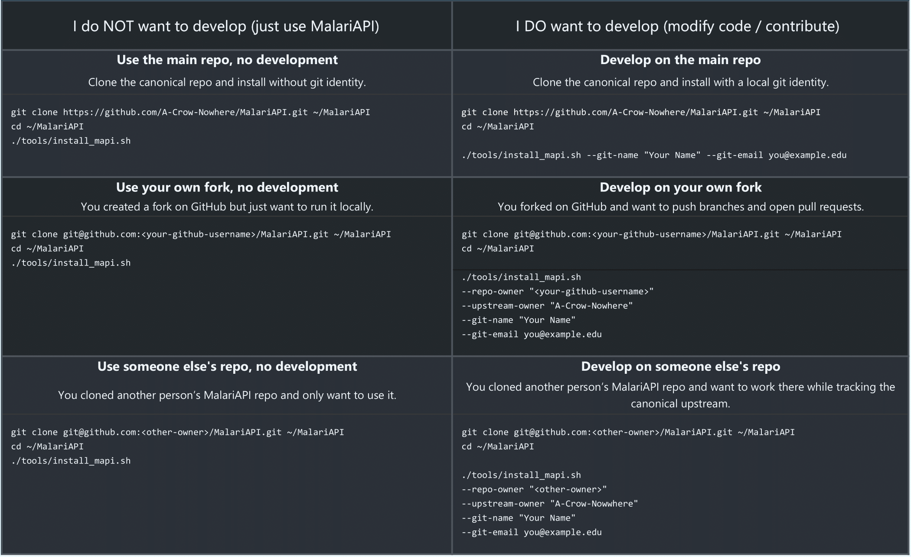

# Install MalariAPI (MAPI)

Below, we outined a streamlined setup process for MalariAPI, covering both local installation and optional HPC configuration.
> <ins>Vocab</ins>\
> repo = "Repository" - the centralized github location that contains the code.\
> main = The most top level, base truth version of a program (e.g. A-Crow-Nowhere/MalariAPI).\
> clone = a copy of an upstream repo.\
> branch = a cloned, but developmentally independent version of a repo.\
> fork = you can 'fork' a branch - to create a new branch.

### 1. (Optional) Fork the Repository

If you plan to contribute:

1. Visit: https://github.com/A-Crow-Nowhere/MalariAPI
2. Select "Fork" to create your personal copy.

This lets you push to your own fork while still pulling updates from the main repository.

## Choose your installation path
Pick the box that matches what you did and what you want.
> First install will take several minutes. 

<p align="center">
  
</p>

<p align="center">
  <a href="installOptions_cropped.pdf">Download PDF (copy-paste friendly)</a>
</p>

> If in doubt, or for more novice users, select the first in either column. All features can be added in aftwards by running the installer again; as in these examples.

> If using the developer install with a local fork, and do not want to develop against main, choose a different owner name uder the --upstream-owner flag
###After any of the above

```bash
source ~/.bashrc    # or: source ~/.zshrc -- this just refreshes the workspace
mapi --help
```

You are now ready to use or develop MalariAPI.


## 4. Install MalariAPI on Your HPC (optional)

MAPI supports the use of a High Preformance Cluster while operating out of a local environment. This reduces complexity for new users, while ensuring stable running environments, and facilitating an easier (and customizable) coding experience.

From your local clone:

```bash
cd ~/MalariAPI

./tools/hpc_install  <the_name_of_your_hpc (or any single word)>  <host_name> <partition> <allocation>

eg:

./tools/hpc_install  <rivanna> <userID@login.hpc.virginia.edu> <standard> <mymalarialab>

```
Test the connection:

```bash
mapi rivanna status
```

A valid response confirms successful HPC setup, should look like a single line:
```
'             JOBID PARTITION     NAME     USER ST       TIME  NODES NODELIST(REASON)'
```

## 5. Git Helper Commands in MAPI (optional, but recomended) 

Using the MAPI installer automatically wires you in to be able to use github (If username and email are given). MAPI provides simple wrappers for common git operations. 

```bash
mapi git update  # Update your local branch from upstream (i.e. from main)
mapi git upload  # Upload your current branch to your fork (i.e. your devloper environment)
mapi git switch feature/new_module # Switch or create a branch (if you have access to multiple branches)
```


## 6. Build any additional Conda environments as needed with MAPI’s environment tools.
```bash
cd ~MalariAPI
bash ./tools/install_envs    # This will take a while to complete, depending on the number of environments included in your repo's envs/ folder. 
```


## 7. Next Steps

List available modules and pipelines:

```bash
mapi 
```

## Installation Complete
You now have a fully functional local and HPC installation of MalariAPI.
Refer to the Contributing section for details on module and pipeline development.


